# Aperçu du Template

> [!IMPORTANT]
>💡 Pour réaliser la maquette d'un dossier, nous utilisons un template Figma. Ce template a longtemps évoluer pour à la fois offrir une grande liberté de design mais aussi, respecter les contraintes imposer par le moteur front.
>La version actuelle du fichier template est **2.2.1**. Le fichier est disponible ici : [Template - Nouveau Projet - v2.2.1](https://www.figma.com/design/Tw24ucDoIAP6PsiNn3q4AH/Template---Nouveau-Projet---v2.2.1?m=auto&t=kDqoJ0FsfXUU4THx-1).
>Il nous sert de base pour démarrer toutes nos maquettes.

## Pages

Le template se décompose en plusieurs pages.

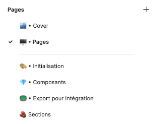

La page **`Cover`** permet de créer l’aperçu du fichier dans le Draft. Il utilise les variables `mc` (la couleur principale du projet), `Nom du site`, `Assistante Co` et `Graphiste`.

La page **`Pages`** (lol) contient les pages de contenus du site à faire. Par défaut, il contient la page d’accueil ainsi que la page 2. On peu dupliquer le plan de travail pour créer autant de page que nécessaire.

La page **`Initialisation`** présente le composant du logo du client ainsi que les styles de texte et les variables de couleurs. C’est le point de départ d’un nouveau projet. on ajoute ici le logo, qui va nous permettre de définir les couleurs et les polices à utiliser.

La page **`Composants`** contient tous les composants récurrents d’un projet à l’autre (header, footer, titres, boutons). Ces composants pourront être utilisés sur les pages du site.

La page **`Export pour Intégration`** propose les tailles d’exports pour les slider, banner et parallaxe, ainsi que les fichiers favicon, newsletter (qui s’affiche avec le popin) et le placeholder (qui s’affiche sur les items BDD qui ne contiennent pas de photo renseignée).

La page **`Sections`** contient une partie des sections que l’on retrouve sur la plupart de nos sites. Ces sections utilisent déjà les composants de la page Composant et sont donc rapide d’utilisation. Elles peuvent être copiés directement sur les page du site. Attention toutefois, certaines utilisent leurs propres composants (cards, toggles etc), il sera alors plus simple de couper/coller ces sections, pour pouvoir éditer ces composants selon leurs contenus.

## Variables

Les variables définissent certaines informations ou valeurs qui vont faciliter le design de la maquette. Certaines devront être définies avec les informations propres au dossier (ex : nom du client, téléphone, couleurs etc) tandis que d’autres sont propres au moteur front (ex : largeurs de colonnes ou espacements)

> [!NOTE]
> Pour accéder au panneau et pouvoir modifier les variables, il est nécessaire qu’aucun calque ne soit sélectionné. Le panneau “Local variable” se trouve dans la partie supérieure du panneau latéral droit

Une fois le panneau ouvert, les variables se présentent ainsi :

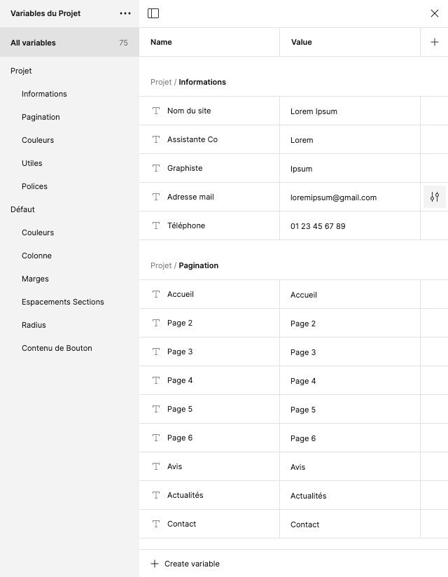

> [!NOTE]
> Pour modifier les variables, on édite le contenu du champs “Value” correspondant.

On peut alors renseigner les **informations** de base telles que le nom, le mail etc, puis les différentes pages qui formeront la navigation (**pagination**).

Parfois, on doit ajouter des pages ou d’autres informations telles qu’un second numéro de téléphone. Le plus simple pour cela est de dupliquer une variable existante via un clic droit.

Toutes ces valeurs vont servir à remplir le header et le footer automatiquement.

> [!CAUTION]
> Pour le footer, il faudra renseigner l’adresse postale du client ainsi que ses horaires, qui ne sont pas variabilisé. (On ne peux pas faire de retour à la ligne dans la value des variables, dommage)

### Les couleurs (Projet)

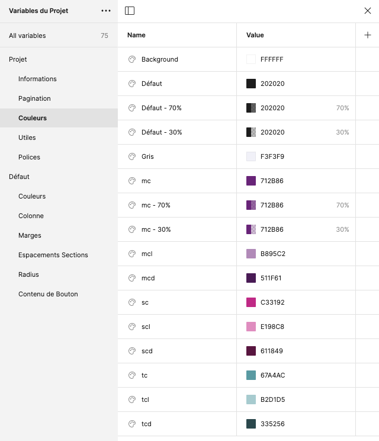

Les variables de couleurs sont divisées en 2 sections : les couleurs du projets et celles par défaut.

Les couleurs du projet sont définies par la charte du client, si elle existe, sinon c’est au graphiste de la définir. 

La couleur `Défaut` correspond à la couleur des paragraphes du site et de tous les textes par défaut.

Les couleurs `mc`, `sc`, `tc` correspondent aux couleurs du clients, et peuvent être utilisées sur les titres, les boutons, background etc.

`mcl`, `mcd`, `scl`, `scd`, `tcl`, `tcd` correspondent à des variantes de `mc`, `sc`, `tc` ; *l pour lighten et d pour darken.*

### Les Utiles (Projets)

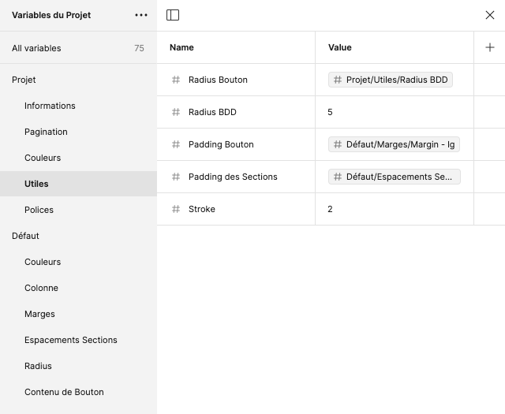

Les variables utiles permettent de définir certains aspects récurrents d’un design (ex bords arrondis, épaisseur des traits, padding).

Ainsi `Radius Bouton` et `Radius BDD` permettent de définir l’arrondis appliqué aux boutons, cards, items BDD etc. 

La variable `stroke` permet de définir une taille de bordure ou de trait, comme ceux présents dans le filet  sous les titres.

> [!NOTE]
> On voit sur la capture précédente que le `Radius Bouton` contient une autre variable en tant que valeur. C’est ce que Figma appelle un alias. 
> Pour en créer un, on fait un clic droit sur la valeur à modifier et “Create Alias” ou “Clear Alias” selon le cas et l’on va chercher la variable désirée.

### Les Polices (Projets)

Les variables de Polices permettent de gérer les fonts utilisées pour la maquette. 

`mf`, `sf` et `tf` doivent comporter les noms des fonts, tels que la liste des polices de Figma les affiche (attention à l’orthographe). Communément, `mf` *(pour main-font)* correspond à la police des textes par défaut et `sf` *(pour second-font)* à celle des titres. `tf` lui est facultatif mais permet d’ajouter au besoin un troisième font *(third-font)*.

> [!NOTE]
> Si une variable de police n’a pas besoin d’être définie, comme `tf` par exemple, elle prendra la value Aucune.

`rg` et `bd` définissent les graisses utilisées respectivement pour les textes par défaut et en gras. Là encore, attention à l’orthographe des values, d’autant que certaines fonts n’ont pas forcément une version semibold ou extrabold par exemple.

`sz` et `lh` définissent la taille et l’interlignage de base utilisés pour la maquette. Elles sont utilisées dans les styles de paragraphes.

### Les Variables Défaut

Les variables qui composent le groupe Défaut sont définies selon la partie front du moteur utilisé par les intégrateurs. 

Les **Couleurs** sont le noir absolue et le blanc absolue. 

Les variables de **Colonne** sont les dimensions de chaque colonne de la grille utilisé. Elle permettent de définir les largeurs des images des colonnes de textes ou de n’importe quels éléments dans un container.

Les **Marges** sont des valeurs utilisées pour espacer des éléments entre eux. Elles peuvent être appelées pour gérer le gap d’un auto-layout ou même les padding d’un éléments.

Les variables d’**Espacements Section** sont des valeurs définies par la partie front pour gérer les espaces blancs entre chaque sections.

Les variables de **Radius** fixent des valeurs absolues utiles pour créer rapidement des éléments ronds ou bien sans radius.

**Contenu de Bouton** identifie les mots récurrents que l’on à aperçu sur l’ensemble de notre production. Il peuvent être utilisés en variable de contenu sur les calque de texte des boutons.

## Styles de Texte

> [!NOTE]
> Les styles de texte sont accessibles via le panneau droit de Figma. (lorsqu’aucun calque n’est sélectionné).

Ils permettent de définir l’aspect des différents éléments textuels du site (paragraphes, H1, H2 etc). Ainsi, ils sont organisés selon leur contexte d’utilisation (Slider, Titres etc). 

Les styles Icônes utilisent la police d’icônes Font-Awesome. On évite de les modifier.

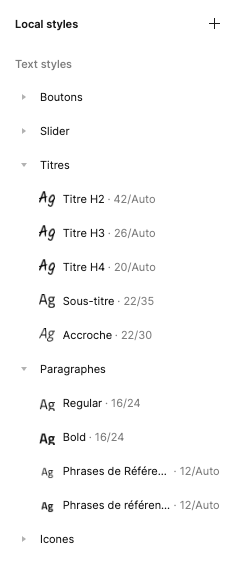

Pour **modifier un style**, il existe deux façon de faire :

Via le panneau latéral droit de Figma (comme indiqué précédemment), un bouton **Edit Text Style** à coté de chaque style permet d’ouvrir le panneau d’édition.

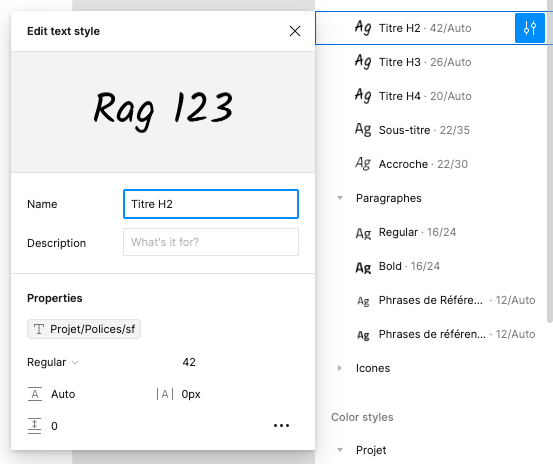

En sélectionnant directement un calque utilisant un style de texte, on peut éditer le style via la même fenêtre.

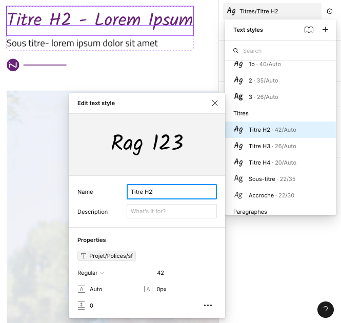

### Batch Styler

Pour pouvoir modifier plusieurs styles à la fois, on utilise le plugin **Batch Styler**, accessible via le menu des plugins :

[Figma Batch Styler: Multi-Style Plugin for Figma](https://jansix.at/resources/figma-batch-styler?ref=batch-styler-plugin)

Il se présente sous la forme d’un popup. On peut alors sélectionner plusieurs styles et leur appliquer une même police, taille, etc (attention, il n’utilise pas les variables de police). On valide en cliquant sur Update Style.

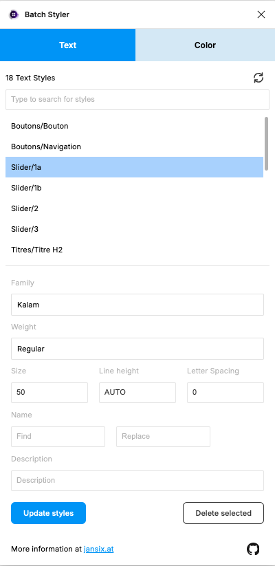

## Les composants

### Header

Le header se trouve dans la page **`Composant`**.

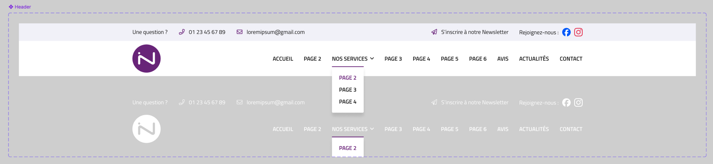

> [!NOTE]
> Le header est basé sur celui initialisé en front. Il est difficilement éditable. en cas de demande particulière (logo au milieu), demander la faisabilité à un intégrateur.

#### Réglages globales

En cliquant sur le composant Header, on peut rapidement le configurer grace à ses propriétés :

- **Newsletter** permet d’afficher ou de masquer le bouton “S’inscrire à notre Newsletter”
- **Réseaux Sociaux** permet d’afficher ou de masquer les logos des réseaux. Il utilise le composant `Réseaux Sociaux`.
- Si le site prévoit une traduction, on peut activer la propriété **Langues**, ce qui affichera les drapeaux pour sélectionner la langue.
- **Bouton Menu** permet d’afficher ou de masquer un bouton dans la navigation.
- **Click’n’Collect** permet lui d’afficher ou de masquer le panier utilisé par la BDD Produit. Il utilise le composant `Header - Panier`
- **Sous-Page** affiche ou masque le composant qui permet de regrouper plusieurs pages contenu. Il utilise le composant `Sous-Page`
- **Séparation** offre la possibilité d’ajouter des éléments entre chaque page de la navigation. Il utilise le composant `Header - Séparation`.

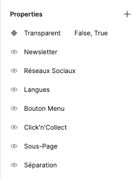

Pour modifier une propriété, il suffit de cliquer sur le petit symbole suivant :

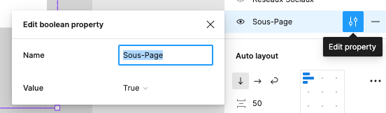

#### Réglages locaux

On peut également modifier l’une ou l’autre version du header en cliquant sur l’élément à modifier. Le cas typique est la partie supérieure du header qui devient colorée, il faut alors rendre le texte et les pictos blancs.

Par exemple, pour modifier la couleur des logos des réseaux, on sélectionne le composant `Réseaux Sociaux` Alors dans le panneau droit, on peux activer la version monochrome.

Pour les textes, on clique directement sur l’élément ou le groupe d’éléments et on modifie la couleur de manière classique.

#### Le logo

Le logo est un cas complexe. Il utilise le composant `Logo` de la page **Initialisation**. Pour être sûr qu’il ne soit pas déformer, assurez-vous que les calques présents dans le composants soient bien en `Constraints : Scale` . On pourra ensuite faire un Reset Size et le redimensionner proportionnellement.

Le logo est contenu dans un auto-layout avec le menu de navigation. Il faudra peut être recentrer le groupe dans la partie basse du header.

### Le Footer

Le footer se trouve également dans la page **`Composant`**.

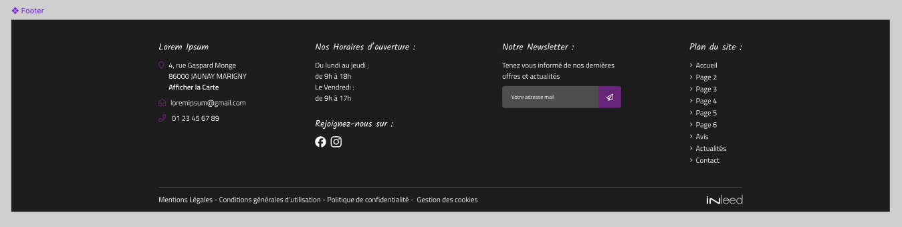

> [!NOTE]
> Comme le header, le footer est basé sur celui initialisé en front. La marque de fabrique Inleed requiert un footer de 4 colonnes. En cas de demande particulière, demander la faisabilité à un intégrateur.

En cliquant sur le composant `Footer`, on peut rapidement le configurer grace à ses propriétés :

- **Newsletter** permet d’afficher ou de masquer la partie Newsletter du footer.
- **Réseaux Sociaux** permet d’afficher ou de masquer les logos des réseaux ainsi que son titre. Il utilise le composant `Réseaux Sociaux`.
- **Maps** permets d’afficher ou de masquer un aperçu de Google Maps. On l’utilise généralement lorsqu’il n’y a pas de newsletter.
- **Plusieurs adresses** permet d’afficher ou de masquer des points sous la partie adresse, simulant un carousel présentant les différentes adresses du client. Il utilise le composant `Slides - Dots`.

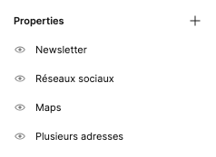

### Les Boutons

Les boutons se trouvent dans la page `Composants`.

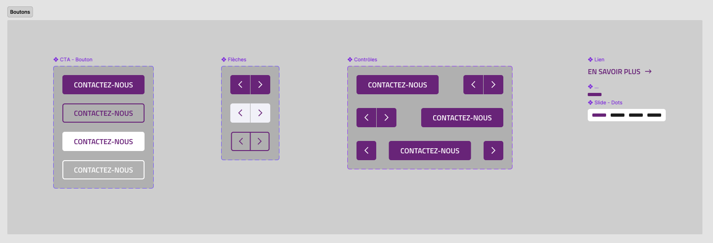

On retrouve dans la section Boutons plusieurs composants utiles.

- **Le CTA** : c’est le bouton principal, sur nos sites c’est souvent un lien vers les pages du site ou des pages externes. **On peut changer la couleur de chaque variant bouton, mais on évitera de la changer sur ses instances**. Il utilise le style de texte `Bouton` et peut contient par défaut le variable de texte `Contactez-nous`. Cette variable pourra-t-être changée ou supprimer sur les instances du bouton. Plusieurs propriétés sont initialisés, comme la fonction (*Type*) et l’apparence (*Contour*). D’autres peuvent être créés en dupliquant l’un des variants.
- **Les Flèches** : elles sont utilisés pour indiquer qu’un carousel contient plusieurs éléments qui ne sont pas affichés par défaut sur la page mais qui existent. Elles n’utilisent pas de style de texte, mais utilise la police Font-Awesome. On peut modifier sa couleur ainsi que les icônes.
- **Les Contrôles** : ils sont souvent utilisés dans les sections BDD mais peuvent aussi servir dans les sections contenu. Il utilise les composants `CTA` et `Flèches` et offre 3 choix de positionnement (*Orientation*).
- **Les Liens** : ils s’utilisent pour afficher un lien de manière moins importante qu’un bouton. Il utilise le style de texte Bouton et possède une flèche modifiable (c’est une icône Font-Awesome).
- **Slide - Dots** : ce sont les points qui affichent le nombres d’éléments dans un carousel. Il utilise le composant `Slide - Dot` qui définie la taille d’un point. Les couleurs sont modifié dans le composant `Slide - Dots`

### Les Titres

Les titres se trouvent dans la page `Composants`.

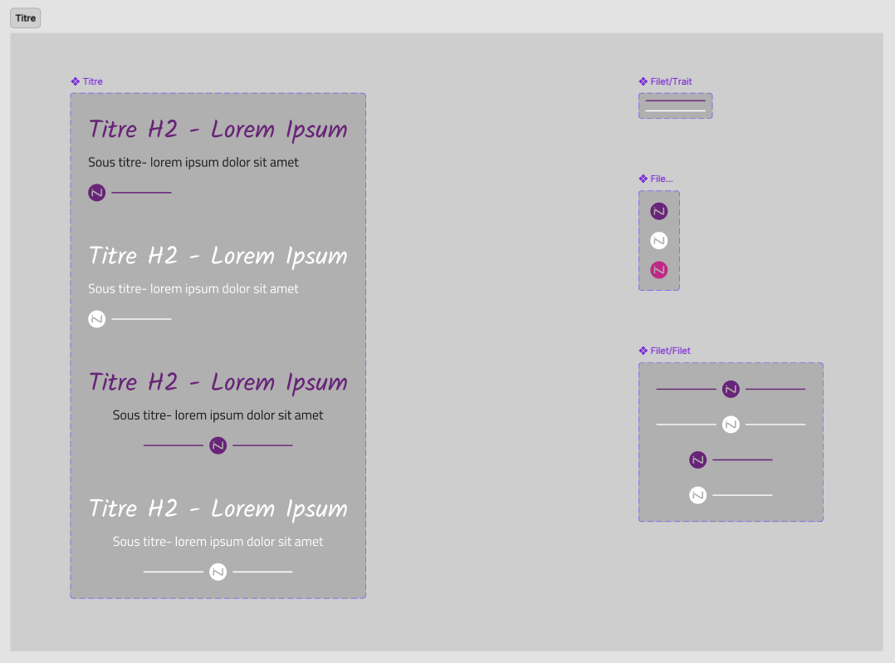

On retrouve dans cette section plusieurs composants :

- **Les Titres** : c’est le composant principal qui définie l’aspect des titres H2. Il est composé de trois éléments : un texte de style H2, un de style Sous-titre et un composant `Filet`. Il possède 4 variants différenciants son orientation (*Alignement*) et sa couleur (*Couleur*). L’alignement règle automatiquement l’auto-layout à gauche ou au centre (pas à droite, c’est interdit par la police du design). La couleur prévoit le titre en version blanche, pour utiliser sur les sections parallaxe, tiles ou ayant background coloré.
- **Le Filet** : le filet est un élément graphique offrant une séparation sous (ou au dessus) le titre. Il est composé des composants `Trait` et `Icone`. On peut le remplacer dans le composant `Titre` par `Icone` seul ou le `Trait` seul.

> [!NOTE]
> Pour des titres équilibrés, pensez à régler le gap entre les éléments textes et le filet qui composent le titre, mais aussi à faire attention à l’interlignage. Tous dépends des fonts utilisées.

### BDD

Certains items BDD sont déjà initialisés avec les style de textes et les variables de couleurs du projet. Ils sont eux même utilisés dans les sections existantes dans la page `Sections`. On évitera donc d’éditer les instances, mais bien le composant de la page `Composants`.

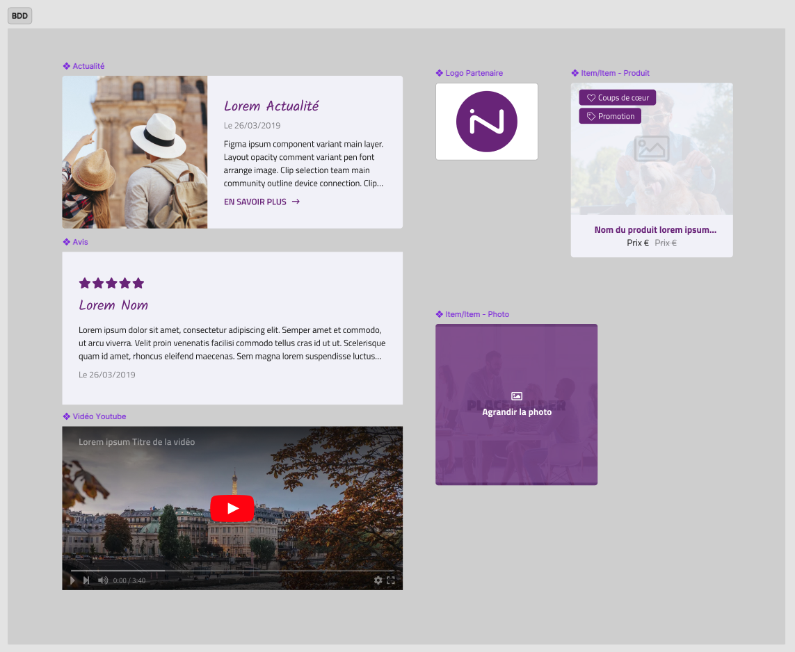

- **Actualité** est le composant utilisé dans les sections BDD présentant les actualités. Basé sur le front, on évite de trop le modifier dans sa structure. Le titre de l’actualité doit toujours utiliser le style de texte `H3`. On peut cependant modifier les couleurs et le radius de la card.
- **Logo Partenaire** est le composant utilisé dans les sections BDD présentant les partenaires ou marques des clients. Il est composé d’une image, celle du logo, qui peut être modifié sur ses instances. En indiquant la propriété Fit à l’image, on peut simuler le rendu réel du composant en front. Le background blanc du composant nous permets d’être sûr que les logos uploadé par les clients s’affichent correctement.
- **Item - Produit** est le composant présentant les produits de la BDD du même nom. Les propriétés Coup de Ceur et Promotion ? permettent d’afficher les labels correspondant sur la photos.
- **Item - Photo** est le composant des photos entrées dans la BDD. La propriété Hover permet d’afficher l’état hover du composant. Pour être réaliste, on en laissera un seul avec l’état hover d’activer sur les sliders d’items photos.
- **Avis** est le composant de la BDD des avis laissé par les clients. Le nom de l’avis peut au choix être un style de texte `H3` ou un `paragraphe gras`.
- L’item **Vidéo Youtube** présente un aperçu d’une vidéo Youtube. La photo poster de la vidéo peut être changée (attention toutefois à ne pas enlever le filtre dégradé noir).