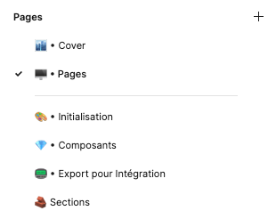
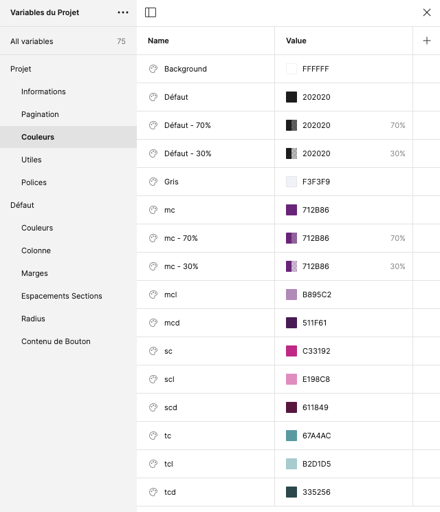
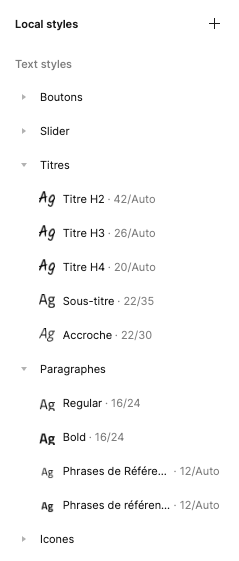
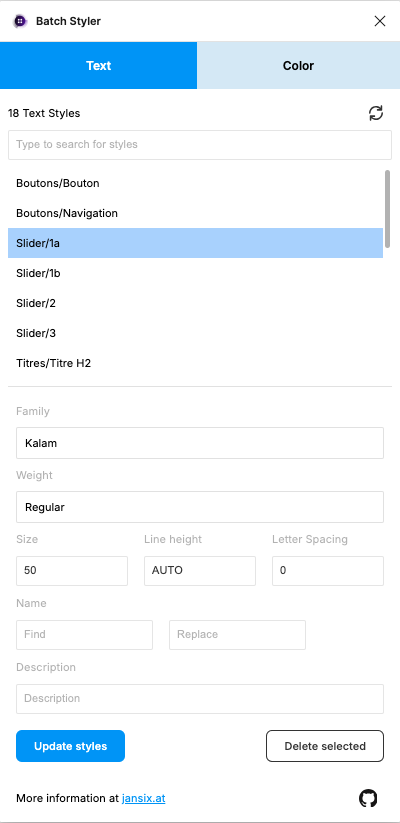

# Processus de design Inleed
<aside>
Auteurs : Gael Bonneau
Edition : Stéphane Renault et Audrey Delhumeau
</aside>

> [!IMPORTANT]
>Ce document a pour but de retracer le processus de maquettage des sites Inleed.
>Lors de notre process nous utilisons les logiciels Inpro (logiciel interne) et [Figma](https://www.figma.com).

## Figma

## Inpro

## Importer un nouveau dossier

### Configurer Inpro

### Importer le dossier

## Créer la maquette Figma

### Aperçu du template

> [!IMPORTANT]
>💡 Pour réaliser la maquette d'un dossier, nous utilisons un template Figma. Ce template a longtemps évoluer pour à la fois offrir une grande liberté de design mais aussi, respecter les contraintes imposer par le moteur front.
>La version actuelle du fichier template est **2.2.1**. Le fichier est disponible ici : [Template - Nouveau Projet - v2.2.1](https://www.figma.com/design/Tw24ucDoIAP6PsiNn3q4AH/Template---Nouveau-Projet---v2.2.1?m=auto&t=kDqoJ0FsfXUU4THx-1)
>Il nous sert de base pour démarrer toutes nos maquettes. Vous trouverez ici toutes les informations nécessaires pour initialiser un projet.

#### Pages

Le template se décompose en plusieurs pages.

La page **`Cover`** permet de créer l’aperçu du fichier dans le Draft. Il utilise les variables `mc` (la couleur principale du projet), `Nom du site`, `Assistante Co` et `Graphiste`.

La page **`Pages`** (lol) contient les pages de contenus du site à faire. Par défaut, il contient la page d’accueil ainsi que la page 2. On peu dupliquer le plan de travail pour créer autant de page que nécessaire.

La page **`Initialisation`** présente le composant du logo du client ainsi que les styles de texte et les variables de couleurs. C’est le point de départ d’un nouveau projet. on ajoute ici le logo, qui va nous permettre de définir les couleurs et les polices à utiliser.

La page **`Composants`** contient tous les composants récurrents d’un projet à l’autre (header, footer, titres, boutons). Ces composants pourront être utilisés sur les pages du site.

La page **`Export pour Intégration`** propose les tailles d’exports pour les slider, banner et parallaxe, ainsi que les fichiers favicon, newsletter (qui s’affiche avec le popin) et le placeholder (qui s’affiche sur les items BDD qui ne contiennent pas de photo renseignée).

La page **`Sections`** contient une partie des sections que l’on retrouve sur la plupart de nos sites. Ces sections utilisent déjà les composants de la page Composant et sont donc rapide d’utilisation. Elles peuvent être copiés directement sur les page du site. Attention toutefois, certaines utilisent leurs propres composants (cards, toggles etc), il sera alors plus simple de couper/coller ces sections, pour pouvoir éditer ces composants selon leurs contenus.

##### Variables

Les variables définissent certaines informations ou valeurs qui vont faciliter le design de la maquette. Certaines devront être définies avec les informations propres au dossier (ex : nom du client, téléphone, couleurs etc) tandis que d’autres sont propres au moteur front (ex : largeurs de colonnes ou espacements)

> [!NOTE]
> Pour accéder au panneau et pouvoir modifier les variables, il est nécessaire qu’aucun calque ne soit sélectionné. Le panneau “Local variable” se trouve dans la partie supérieure du panneau latéral droit

Une fois le panneau ouvert, les variables se présentent ainsi :

> [!NOTE]
> Pour modifier les variables, on édite le contenu du champs “Value” correspondant.

On peut alors renseigner les **informations** de base telles que le nom, le mail etc, puis les différentes pages qui formeront la navigation (**pagination**).

Parfois, on doit ajouter des pages ou d’autres informations telles qu’un second numéro de téléphone. Le plus simple pour cela est de dupliquer une variable existante via un clic droit.

Toutes ces valeurs vont servir à remplir le header et le footer automatiquement.

> [!CAUTION]
> Pour le footer, il faudra renseigner l’adresse postale du client ainsi que ses horaires, qui ne sont pas variabilisé. (On ne peux pas faire de retour à la ligne dans la value des variables, dommage)

###### Les couleurs (Projet)

Les variables de couleurs sont divisées en 2 sections : les couleurs du projets et celles par défaut.

Les couleurs du projet sont définies par la charte du client, si elle existe, sinon c’est au graphiste de la définir. 

La couleur `Défaut` correspond à la couleur des paragraphes du site et de tous les textes par défaut.

Les couleurs `mc`, `sc`, `tc` correspondent aux couleurs du clients, et peuvent être utilisées sur les titres, les boutons, background etc.

`mcl`, `mcd`, `scl`, `scd`, `tcl`, `tcd` correspondent à des variantes de `mc`, `sc`, `tc` ; *l pour lighten et d pour darken.*

###### Les Utiles (Projets)

Les variables utiles permettent de définir certains aspects récurrents d’un design (ex bords arrondis, épaisseur des traits, padding).

Ainsi `Radius Bouton` et `Radius BDD` permettent de définir l’arrondis appliqué aux boutons, cards, items BDD etc. 

La variable `stroke` permet de définir une taille de bordure ou de trait, comme ceux présents dans le filet  sous les titres.

> [!NOTE]
> On voit sur la capture précédente que le `Radius Bouton` contient une autre variable en tant que valeur. C’est ce que Figma appelle un alias. 
> Pour en créer un, on fait un clic droit sur la valeur à modifier et “Create Alias” ou “Clear Alias” selon le cas et l’on va chercher la variable désirée.

###### Les Polices (Projets)

Les variables de Polices permettent de gérer les fonts utilisées pour la maquette. 

`mf`, `sf` et `tf` doivent comporter les noms des fonts, tels que la liste des polices de Figma les affiche (attention à l’orthographe). Communément, `mf` *(pour main-font)* correspond à la police des textes par défaut et `sf` *(pour second-font)* à celle des titres. `tf` lui est facultatif mais permet d’ajouter au besoin un troisième font *(third-font)*.

> [!NOTE]
> Si une variable de police n’a pas besoin d’être définie, comme `tf` par exemple, elle prendra la value Aucune.

`rg` et `bd` définissent les graisses utilisées respectivement pour les textes par défaut et en gras. Là encore, attention à l’orthographe des values, d’autant que certaines fonts n’ont pas forcément une version semibold ou extrabold par exemple.

`sz` et `lh` définissent la taille et l’interlignage de base utilisés pour la maquette. Elles sont utilisées dans les styles de paragraphes.

###### Les Variables Défaut

Les variables qui composent le groupe Défaut sont définies selon la partie front du moteur utilisé par les intégrateurs. 

Les **Couleurs** sont le noir absolue et le blanc absolue. 

Les variables de **Colonne** sont les dimensions de chaque colonne de la grille utilisé. Elle permettent de définir les largeurs des images des colonnes de textes ou de n’importe quels éléments dans un container.

Les **Marges** sont des valeurs utilisées pour espacer des éléments entre eux. Elles peuvent être appelées pour gérer le gap d’un auto-layout ou même les padding d’un éléments.

Les variables d’**Espacements Section** sont des valeurs définies par la partie front pour gérer les espaces blancs entre chaque sections.

Les variables de **Radius** fixent des valeurs absolues utiles pour créer rapidement des éléments ronds ou bien sans radius.

**Contenu de Bouton** identifie les mots récurrents que l’on à aperçu sur l’ensemble de notre production. Il peuvent être utilisés en variable de contenu sur les calque de texte des boutons.

##### Styles de Texte

> [!NOTE]
> Les styles de texte sont accessibles via le panneau droit de Figma. (lorsqu’aucun calque n’est sélectionné).

Ils permettent de définir l’aspect des différents éléments textuels du site (paragraphes, H1, H2 etc). Ainsi, ils sont organisés selon leur contexte d’utilisation (Slider, Titres etc). 

Les styles Icônes utilisent la police d’icônes Font-Awesome. On évite de les modifier.

Pour **modifier un style**, il existe deux façon de faire :

Via le panneau latéral droit de Figma (comme indiqué précédemment), un bouton **Edit Text Style** à coté de chaque style permet d’ouvrir le panneau d’édition.

En sélectionnant directement un calque utilisant un style de texte, on peut éditer le style via la même fenêtre.

###### Batch Styler

Pour pouvoir modifier plusieurs styles à la fois, on utilise le plugin **Batch Styler**, accessible via le menu des plugins :

[Figma Batch Styler: Multi-Style Plugin for Figma](https://jansix.at/resources/figma-batch-styler?ref=batch-styler-plugin)

Il se présente sous la forme d’un popup. On peut alors sélectionner plusieurs styles et leur appliquer une même police, taille, etc (attention, il n’utilise pas les variables de police). On valide en cliquant sur Update Style.

