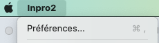
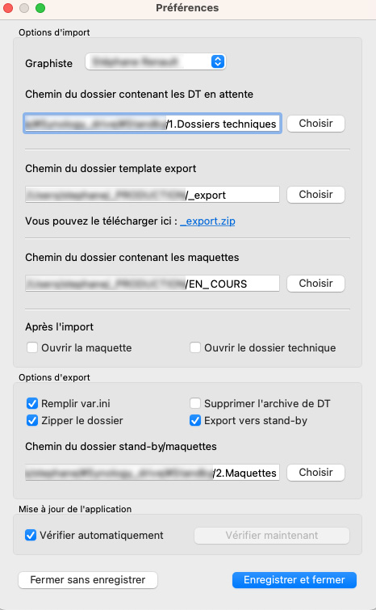
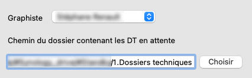
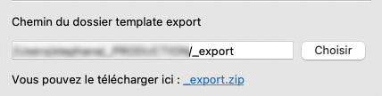
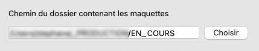
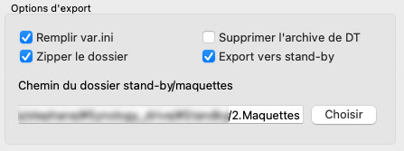
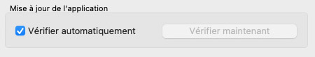
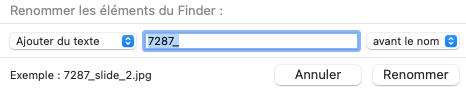

# Processus de design Inleed

**Auteurs** : Gael Bonneau
**Edition** : Stéphane Renault et Audrey Delhumeau

> [!NOTE]
>Ce document a pour but de retracer le processus de maquettage des sites Inleed.

## Table des matières
- [Logiciels utilisés](#logiciels-utilisés)
  - [Figma](#figma)
  - [Inpro](#inpro)
    - [Configurer Inpro](#configurer-inpro)
- [Importer un nouveau dossier](#importer-un-nouveau-dossier)
- [Créer la maquette](#creer-la-maquette)

## Logiciels utilisés
### Figma
Pour commencer une maquette, le graphiste doit créer son compte sur [Figma](https://www.figma.com/signup) avec son adresse mail Inleed. Nous nous contentons pour le moment de la version gratuite de Figma qui nous permets de partager un nombre limité mais suffisant de template. Une fois le compte crééer, le graphiste sera ajouté aux équipes **In • Production** et **In • Asgard**, ce qui lui permettra d'utiliser les fichiers partagés.

### Inpro
Pour importer et exporter les maquettes, nous utilisons le logiciel Inpro, créé spécialement pour cette tache par Stéphane. Il devra au préalable être configuré rigoureusement pour se brancher vers les dossiers disponibles dans le Drive.

#### Configurer Inpro
Pour se faire, lors de la première ouverture d’Inpro, un popup s’ouvre pour inviter l’utilisateur à configurer le logiciel. Par la suite, on peut toujours accéder à la fenêtre de configuration, en cliquant sur « Inpro » (à côté du logo Apple), dans la barre du haut puis « préférences… » on peut également utiliser le raccourci cmd (Command) + , (virgule) :



La fenêtre se présente alors ainsi :



##### Options d'import
Dans un premier temps, on va sélectionner son nom dans la liste déroulante « graphiste ». Cela va préfixer le zip exporté avec les initiales du graphiste.



Dans un second temps, on va cliquer sur le bouton « choisir » et aller récupérer le dossier qui contient les fichiers .zip déposés par les assistantes. C'est celui qui est synchronisé avec le dossier `1. Dossiers techniques` du Drive.

Ensuite, on configure le dossier template export :



Ce dossier correspond à celui qui contient les fichiers de base et qui est nécessaire à la création du dossier de prod. Il faut donc impérativement, qu'il soit présent en local sur son ordinateur. Pour cela, on peut le télécharger via le lien présent sous le champs texte.
On le configure de la même façon que pour le dossier des dt, en cliquant sur choisir puis en allant le chercher là où il a été enregistré.

On peut continuer en configurant le dossier qui contient (ou va contenir) les dossiers de travail (celui contenant le dt, les img, etc.) :



Il dépend de l'organisation de chacun. La procédure de config est la même que précédement.

Dans la partie « Après l'import », on peut laisser tout décoché car c'est devenu obsolète.

On en arrive maintenant aux « Options d'export » :



On coche tout sauf « Supprimer l'archive de DT » car il doit rester accessible aux devs back. Le chemin du dossier des « maquettes » doit pointer vers le dossier `2. Maquettes` du Drive.

On termine sur les mises à jour de l'appli :



Il vaut mieux le laisser coché, cela permet d'être averti lorsqu'une mise à jour est disponible.

La configuration d'Inpro est terminée. On peut désormais commencer à importer des dossiers techniques.


## Importer un nouveau dossier
La première étape est de consulter l'extranet pour savoir quel dossier il faut importer.

Sur l'extranet, dans l'onglet `Projets en cours > Maquettes > Maquettes en attente`, le premier dossier en haut de la liste est le dossier le plus vieux, c'est donc lui qu'il faut privilégié. Si un dossier est urgent, il est indiqué en rouge et passe automatiquement en haut de la liste. Le graphiste ajoute donc son nom en éditant le champs Maquette du dossier. Celui ci passera automatiquement dans le sous onglet `Projets en cours > Maquettes > Maquettes en cours`.

Ensuite il faut récupérer le dossier via Inpro. Au lancement d'Inpro, on arrive sur l'onglet IMPORT, qui affiche la liste des dossiers disponibles sur le Drive. Pour initialiser le dossier, il suffit de cliquer sur le nom du dossier que l'on vient de choisir sur l'extranet, puis de cliquer sur **Importer**.
Si aucun dossier n'apparait dans la liste, on s'assurera que la [configuration d'Inpro](#configurer-inpro) est correcte. Le bouton ***Ouvrir "Dossiers Techniques"** permets d'accèdez directement aux fichiers sur le Drive.

Une fois importé, le dossier sélectionné doit se retrouver dans votre dossier **Maquettes**. Il se compose de deux dossiers : `_src` et `0000_nomdudossier`. Le premier contient tout le nécessaire fournis par l'assistante pour la réalisation de la maquette, à savoir, les photos, les logos et les documents. Le second sera celui qui sera exporter pour l'intégration. Il contient le DT, les fichiers `credit.txt` et `var.ini` ainsi que les dossiers `img` et `preview`. Ces deux derniers sont vides puisqu'ils seront remplis par le graphiste lors de l'export.

Il reste maintenant à créer la maquette Figma.

## Créer la maquette Figma

Pour commencer la maquette d'un nouveau dossier, il faut dupliquer le Template de la Team **In • Production** et le renommer par l'identifiant et le nom du dossier (on laisse la sytaxe à l'appréciation du graphiste). Il faut ensuite le déplacer dans son propre Draft afin de laisser la place dans l'équipe (à cause de la version gratuite).

> [!NOTE]
> Pour avoir un tour d'horizon de notre template Figma, consultez la page [Aperçu du Template Figma](/Aperçu%20du%20template%20Figma.md)

On peut maintenant designer !


## Faire valider la maquette

Une fois la maquette terminée, et les calques renommés, il faut faire valider la maquette auprès de l'assistante co et de la direction. Assurez-vous donc avant d'envoyer la maquette, que vous n'avez rien oublié et que le DT est respecté.

Exportez ensuite les pages créées en JPG dans le dossier `0000_nomdudossier/preview`. Pour cela sélectionnez tous les plans de travail, puis en bas à droite, cliquez sur "Export X layers" après avoir sélectionné le format JPG.


Une fois les plans de travail exportés, il faut encore exporter les slides du slider principal en page 1. Pour cela, dupliquez les variants qui ont servis à faire les slides. Renommez les en respectant l'ordre d'apparition des slides (ex : slide_1, slide_2, slide_3).

À l'aide de la fonction "Renommer" du Finder, ajouter l'identifiant du projet (0000) avant chaque nom des pages et des slides.



Envoyez ensuite les fichiers exportés dans le dossier Invision de l'assistante qui a réalisé le dossier, après avoir créé la section nommée *0000 - Nom du Dossier - Prénom du graphiste*

Envoyez un mail à l'assitante, lui indiquant que la maquette est terminée et prête à être validée.

```
Sujet : [Maquette à Valider] - 0000 - Nom du dossier
Message : Salut, Je viens de mettre les maquettes du dossier 0000 - Nom du dossier sur ton Invision pour validation. N’hésites pas à revenir vers moi si tu as une question.
```

Enfin, sur l'extranet, passez l'avancement du dossier à *Maquette en validation*.

## Exporter la maquette

